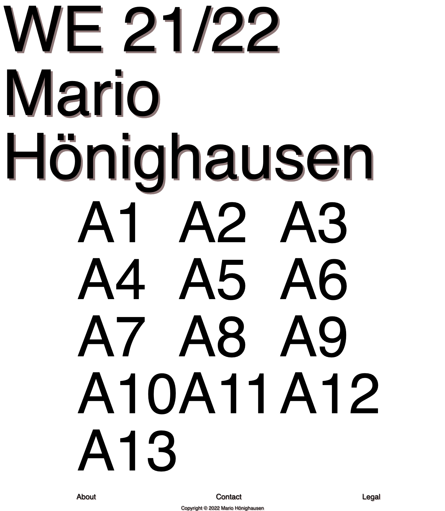
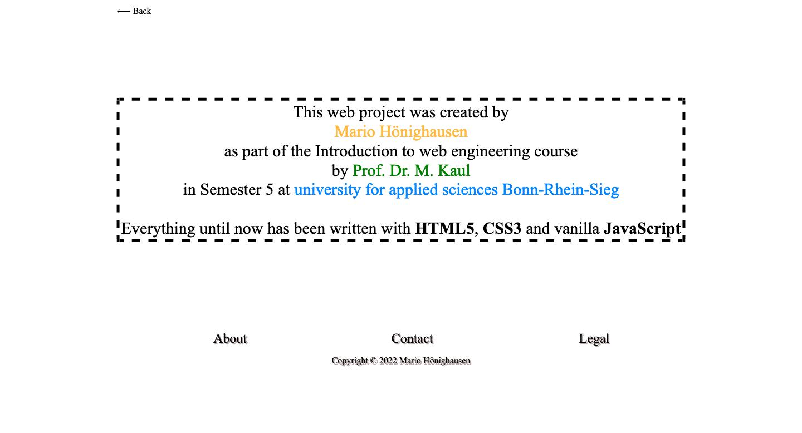
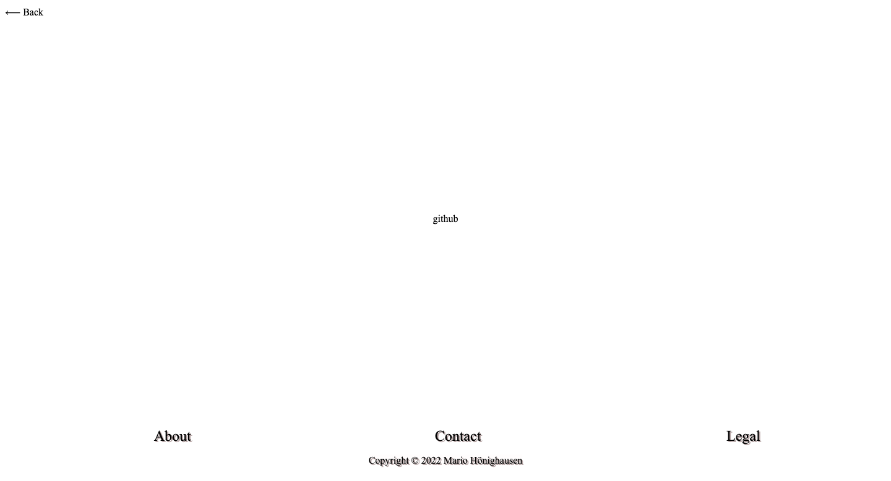
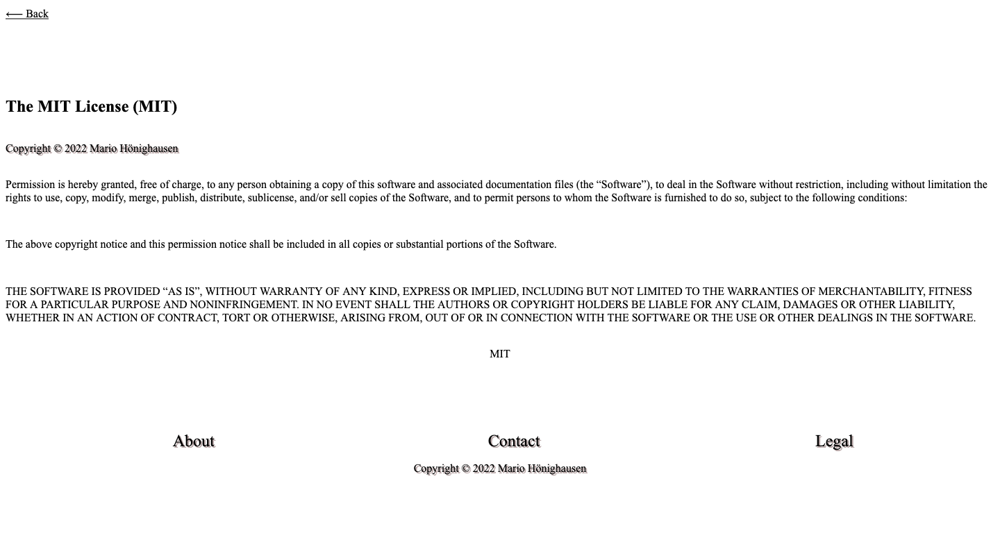
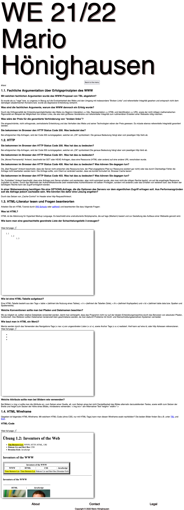
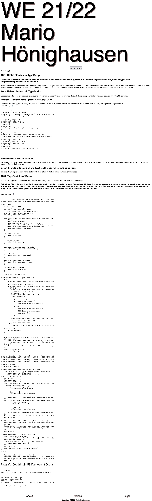

# Web Engineering Semester work

## Table of Contents
* [General information](#general-information)
    * [Description](#description)
    * [Screenshots](#screenshots)
        * [index.html](#index-html)
        * [about.html](#about-html)
        * [contact.html](#contact-html)
        * [legal.html](#legal-html)
        * [html entry](#html-entry)
        * [typescript entry](#typescript-entry)
* [Technologies](#technologies)
    * [Main technologies](#main-technologies)
    * [Task technologies](#task-technologies)
* [Installation](#installation)
* [Usage](#usage)
* [Support](#support)
* [Setup](#setup)
* [Sources](#aources)
* [Roadmap](#roadmap)
* [Contributing](#contributing)
* [Authors](#authors)
* [License](#license)
* [Project Status](#project-status)

## General information
***
### Description
This web project was created by
[Mario Hönighausen](https://github.com/mariohoenighausen)
as part of the Introduction to web engineering course
by [Prof. Dr. Manfred Kaul](https://kaul.inf.h-brs.de) in Semester 5 at university for applied sciences [Bonn-Rhein-Sieg](https://www.h-brs.de/de)

Everything until now has been written in HTML5, CSS3 and JavaScript with additional use of web components to display the tasks submitted in the turn of the semester.

### Screenhots
#### index html

#### about html

#### contact html

#### legal html

#### html entry

#### typescript entry

## Technologies
***
### Main technologies
- HTML5
- CSS3
- JavaScript
    - Web-Components 

### Task Technologies 
- HTML5
- CSS3
- JavaScript
    - DOM
    - Functional programming
    - Async Await/ Promise
- SVG
- TypeScript
    - Deno
- Vue 2.xx
- PHP

## Resources
***
### Development

[W3Schools](https://www.w3schools.com/html/)

[MDN](https://developer.mozilla.org/en-US/docs/Web)

### Used in tasks
[Stop Watches](https://jsfiddle.net/dalinhuang/op8ae79j/)

[Top Sort Algorithm](https://adelachao.medium.com/graph-topological-sort-kahns-algorithm-93380b00e7d7)

## Authors
***
Mario Hönighausen

## License
***
MIT License
